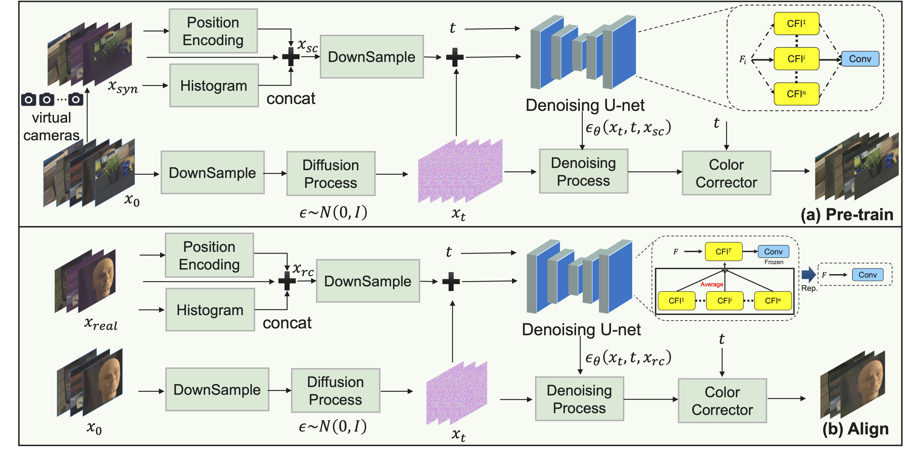

# TS-Diff: Two-Stage Diffusion Model for Low-Light RAW Image Enhancement（IJCNN 2025）

## Pipeline
Two-Stage Diffusion Model (TS-Diff) is a general framework for enhancing extremely low-light RAW images.


## Dataset
QID is a new dataset with quantifiable illumination levels, supporting training and evaluation in extreme low-light environments (e.g., 0.001 lux).


## Installation
* Install the conda environment, Pytorch and some packages.
```
./tools/install.sh
```

## Run
* Use the SID dataset to pre-train the model
```commandline
CUDA_VISIBLE_DEVICES=1,2 nohup python -m torch.distributed.launch --nproc_per_node=2 --master_port=22663 train.py -opt options/Sony_pretrain.yaml --launcher pytorch> Sony_pretrain.log 2>&1
```

* Then use a different dataset to fine-tune the pre-trained model.
```commandline
CUDA_VISIBLE_DEVICES=3 python train_finetune.py -opt options/Sony_finetune.yaml > SID_finetune.log 2>&1
CUDA_VISIBLE_DEVICES=4 python train_finetune.py -opt options/ELD_finetune.yaml > ELD_finetune.log 2>&1
CUDA_VISIBLE_DEVICES=5 python train_finetune.py -opt options/L118_finetune.yaml > L118_finetune.log 2>&1
```
* Test the fine-tuned model
```commandline
CUDA_VISIBLE_DEVICES=3 python test.py -opt options/Sony_test.yaml
CUDA_VISIBLE_DEVICES=4 python test.py -opt options/ELD_test.yaml
CUDA_VISIBLE_DEVICES=5 python test.py -opt options/L118_test.yaml
```


##  Citation
If you find our TS-Diff model useful for you, please consider citing:
```bibtex
@misc{li2025tsdifftwostagediffusionmodel,
      title={TS-Diff: Two-Stage Diffusion Model for Low-Light RAW Image Enhancement}, 
      author={Yi Li and Zhiyuan Zhang and Jiangnan Xia and Jianghan Cheng and Qilong Wu and Junwei Li and Yibin Tian and Hui Kong},
      year={2025},
      eprint={2505.04281},
      archivePrefix={arXiv},
      primaryClass={cs.CV},
      url={https://arxiv.org/abs/2505.04281}, 
}
```
